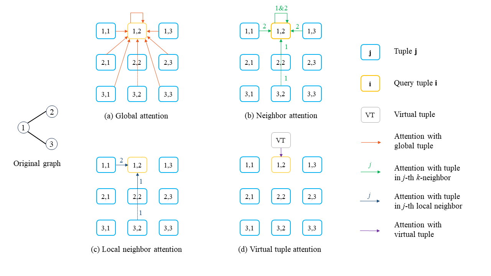

# k-Transformer

Official code repository for AISTATS 2024 paper: On the Theoretical Expressive Power and Design Space of High-Order Graph Transformers. Paper: https://proceedings.mlr.press/v238/zhou24a.html



In this paper, we provide a systematic study of the theoretical expressive power of order- $k$ graph transformers and sparse variants. We first show that, an order- $k$ graph transformer without additional structural information is less expressive than the $k$-Weisfeiler Lehman ($k$-WL) test despite its high computational cost. We then explore strategies to both sparsify and enhance the higher-order graph transformers, aiming to improve both their efficiency and expressiveness. Indeed, sparsification based on neighborhood information can enhance the expressive power, as it provides additional information about input graph structures. In particular, we show that a natural neighborhood-based sparse order- $k$ transformer model is not only computationally efficient, but also expressive – as expressive as $k$-WL test. We further study several other sparse graph attention models that are computationally efficient and provide their expressiveness analysis.

We implement 2-transformers with full attention ($\mathcal A_2$), kernelized attention ($\mathcal A_2-Performer$), neighbor attention ($\mathcal A_2^{\mathsf{Ngbh}}$ and $\mathcal A_2^{\mathsf{Ngbh+}}$), local neighbor attention ($\mathcal A_2^{\mathsf{LN}}$) and virtual tuple attention ($\mathcal A_2^{\mathsf{VT}}$). For ablation study, we also implement cross attention between $1$-tuples and $2$-tuples, as well as sampling connected $3$-tuples. For simplicial transformers, we implement both dense version for order- $0,1,2$ simplices ($\mathcal{AS}_ {0:1}$) which could use Hodge Laplacians as attention biases, and sparse version with simplex neighbor attention ($\mathcal{AS}_ {0:1}^{\mathsf{SN}}$) and virtual simplex attention ($\mathcal{AS}_{0:1}^{\mathsf{VS}}$).

### Python environment setup with Conda

We build our code based on [GraphGPS](https://github.com/rampasek/GraphGPS) with many improvements.

```bash
conda create -n kTransformer python=3.9
conda activate kTransformer

conda install pytorch=1.10 torchvision torchaudio -c pytorch -c nvidia
conda install pyg=2.0.4 -c pyg -c conda-forge

# RDKit is required for OGB-LSC PCQM4Mv2 and datasets derived from it.  
conda install openbabel fsspec rdkit -c conda-forge

pip install torchmetrics
pip install performer-pytorch
pip install ogb
pip install tensorboardX
pip install wandb

conda clean --all
```


### Running k-Transformer

```bash
conda activate kTransformer

# Some examples to run experiments; change the configs files to run the desired experiments

# Running k-Transformer for real-world datasets 
python main.py --cfg configs/k-transformer/alchemy-2Transformer-LocalNgbh_VT_6+RWSE+StableExpPE_MLP_12+EdgeRWSE.yaml  wandb.use False
python main.py --cfg configs/k-transformer/zinc-01SimplicialTransformer-SimplexNgbh_VT_1+RWSE.yaml  wandb.use False

# Running k-Transformer for structure awareness on synthetic datasets
python main.py --cfg configs/k-transformer-StructuralAwareness/csl-2Transformer_LN.yaml  wandb.use False

# Running k-Transformer for substructure counting
python train_count_substructure.py --cfg configs/k-transformer-StructuralAwareness/Count-2Transformer_LN_triangle.yaml  wandb.use False
```

You can also set your wandb settings and use wandb.

### Guide on configs files

Most of the configs are shared with [GraphGPS](https://github.com/rampasek/GraphGPS) code. Since this is a theoretical focused work, we do not perform much hyper-parameter search. Even so, our models achieve highly competitive results across many tasks on both synthetic and real-world datasets. You can change the hyper-parameters in the config files for different variants of our models and different settings:

```
# sepcify order of tuple-based $k$-transformer
model:
  type: kTransformer
  k: 2  # high-order cases include 2 and 3 (default: 2)

# full attention ($\mathcal A_k$)
model:
  type: kTransformer
prep:
  use_local_neighbors: False
gt:
  layer_type: None+Transformer

# kernelized attention ($\mathcal A_k-Performer$)
model:
  type: kTransformer
prep:
  use_local_neighbors: False
gt:
  layer_type: None+Performer

# neighbor attention ($\mathcal A_k^{\mathsf{Ngbh}}$) 
model:
  type: kTransformer
prep:
  use_local_neighbors: True
  use_global_neighbors: True
  use_global_neighbors_delta: False  # default is False
gt:
  layer_type: None+Exphormer

# neighbor-plus attention ($\mathcal A_k^{\mathsf{Ngbh+}}$)
model:
  type: kTransformer
prep:
  use_local_neighbors: True
  use_global_neighbors: False  # default is False
  use_global_neighbors_delta: True
gt:
  layer_type: None+Exphormer

# local neighbor attention ($\mathcal A_k^{\mathsf{LN}}$)
model:
  type: kTransformer
prep:
  use_local_neighbors: True
  use_global_neighbors: False  # default is False
  use_global_neighbors_delta: False  # default is False
gt:
  layer_type: None+Exphormer

# virtual entities: include virtual tuple atention $\mathcal A_k^{\mathsf{VT}}$ and virtual simplex attention $\mathcal{AS}_{0:K}^{\mathsf{VS}}$.
# could be combined with other types of sparse attention
# only supports sparse versions of tuple/simplicial transformers, i.e. cfg.model.type in ['kTransformer', 'kSimplicialTransformerSparse'] and cfg.gt.layer_type == 'Exphormer'
prep:
  num_virt_node: 1 # set the number of virtual entities, including virtual tuples and virtual simplexes
                   # otherwise set 0 if you do not want to use.
model:
  type: kTransformer # assert type in ['kTransformer', 'kSimplicialTransformerSparse']
gt:
  layer_type: None+Exphormer
    
# cross attention between $1$-tuples and $2$-tuples
model:
  type: TensorizedTransformer
  local: True  # set to False if you use global attention, where each 1-tuple computes attention with all 2-tuples
prep:
  use_local_neighbors: False
gt:
  layer_type: None+Tensorized_12_Layer
  update_e: False  # set to True if you want to update the representations of 2-tuples; otherwise, only update the representations of 1-tuples

# simplicial transformers
# dense simpliical attention ($\mathcal{AS}_ {0:2}$) which could use Hodge Laplacians as attention biases
model:
  type: kSimplicialTransformerDense
gt:
  layer_type: None+Transformer
prep:
  use_local_neighbors: True  # set to True if you want to use Hodge Laplacian as attention bias, and False otherwise

# sparse simplicial attention with simplex neighbor attention ($\mathcal{AS}_ {0:2}^{\mathsf{SN}}$)
model:
  type: kSimplicialTransformerSparse
  simplex_pooling: all  # default: 'all', pooling over both 0-simplices and 1-sipmlices; alternative: 'node', pooling over only 0-simplices
gt:
  layer_type: None+Exphormer
prep:
  use_local_neighbors: True  # set to True to use local attention (only consider boundaries, co-boundaries, lower-adjacent simplices and upper-adjacent simplices

# optional expander edges introduced in Exphormer paper (not our focus). 
prep:
  exp: True  # Set True for using expander edges 
    # You should also set use_exp_edges to True.
    # Otherwise expander graphs will be calculated but not used in the Exphormer.
    # You can also change exp_deg and exp_algorithm

# positional and structural encodings
# our models supports a variety of PEs and SEs: we consider the PEs and SEs in GraphGPS, as well as Hodge1Lap and EdgeRWSE in the paper
# Facilitating Graph Neural Networks with Random Walk on Simplicial Complexes
# (see https://proceedings.neurips.cc/paper_files/paper/2023/hash/345208bdbbb6104616311dfc1d093fe7-Abstract-Conference.html)

```


## Citation

```
@InProceedings{pmlr-v238-zhou24a,
  title = 	 { On the Theoretical Expressive Power and the Design Space of Higher-Order Graph Transformers },
  author =       {Zhou, Cai and Yu, Rose and Wang, Yusu},
  booktitle = 	 {Proceedings of The 27th International Conference on Artificial Intelligence and Statistics},
  pages = 	 {2179--2187},
  year = 	 {2024},
  editor = 	 {Dasgupta, Sanjoy and Mandt, Stephan and Li, Yingzhen},
  volume = 	 {238},
  series = 	 {Proceedings of Machine Learning Research},
  month = 	 {02--04 May},
  publisher =    {PMLR},
  pdf = 	 {https://proceedings.mlr.press/v238/zhou24a/zhou24a.pdf},
  url = 	 {https://proceedings.mlr.press/v238/zhou24a.html},
  abstract = 	 { Graph transformers have recently received significant attention in graph learning, partly due to their ability to capture more global interaction via self-attention. Nevertheless, while higher-order graph neural networks have been reasonably well studied, the exploration of extending graph transformers to higher-order variants is just starting. Both theoretical understanding and empirical results are limited. In this paper, we provide a systematic study of the theoretical expressive power of order-$k$ graph transformers and sparse variants. We first show that, an order-$k$ graph transformer without additional structural information is less expressive than the $k$-Weisfeiler Lehman ($k$-WL) test despite its high computational cost. We then explore strategies to both sparsify and enhance the higher-order graph transformers, aiming to improve both their efficiency and expressiveness. Indeed, sparsification based on neighborhood information can enhance the expressive power, as it provides additional information about input graph structures. In particular, we show that a natural neighborhood-based sparse order-$k$ transformer model is not only computationally efficient, but also expressive – as expressive as $k$-WL test. We further study several other sparse graph attention models that are computationally efficient and provide their expressiveness analysis. Finally, we provide experimental results to show the effectiveness of the different sparsification strategies. }
}
```


